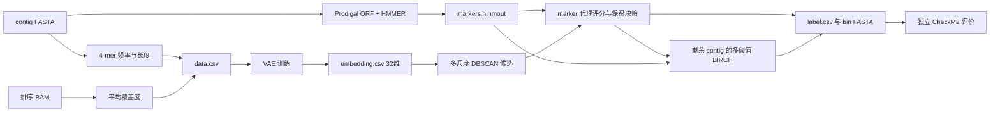

# LorBin 复现与源码阅读教程

本教程以本地 `lorbin-hand:v2` 和单样本 `CRR451057` 为例，按**输入 → 特征 → marker → VAE → DBSCAN → BIRCH → bin 输出 → 独立评价**的执行顺序阅读。完整流程由 `LorBin bin` 一条命令串起；下文列出的子命令用于理解或单独调试，不能假定它们的默认参数与一键命令完全相同。当前 Dockerfile 安装本地 [`LorBin/dist/lorbin-0.1.0.tar.gz`](LorBin/dist/lorbin-0.1.0.tar.gz)，归档 SHA-256 为 `edb2e20b2042c2ab89c8663028352f5c9c5b5a392685b1bee3b8c85c8c89ecea`。静态核查确认：本地实际使用的 13 个 Python 模块及 `setup.py`、归档中的同名文件，与[官方 LorBin 提交 ee102322](https://github.com/LorMeBioAI/LorBin/commit/ee10232282c2b71ed3ce2a34d5dbd78af3dd0b0a)在统一换行符后相同。`generate_cluster()` 临时 stub、`bin_length` 回退及新增 CLI 参数也在上游，不能因这些内容认定是本地修改。归档额外含一个旧备份 `lorbin/lorbin copy.py`，正常 CLI 入口 `lorbin.lorbin:main` 不使用它；因此不应把整个归档描述为官方逐字节原件。源码相同不表示每条 CLI 分支都无缺陷，也不能代替官方同输入结果对照。

## 先把流程理解成六步

1. **准备两份输入**：FASTA 保存组装后的 contig DNA 序列，文件常见后缀是 `.fa`、`.fna` 或 `.fasta`；BAM 保存 reads 比对到这些 contig 的位置。两者必须对应同一份组装。
2. **计算数值特征**：从 FASTA 计算每条 contig 的 4-mer 频率和长度，从 BAM 计算平均 coverage（覆盖深度，作为丰度的代理信息）。按 contig ID 合并成 `data.csv`。本例每行有 136 维 4-mer、1 维 coverage、1 个长度值；长度主要用于训练权重。
3. **准备基因证据这条支路**：同一份 FASTA 还经过 Prodigal 预测 ORF 并翻译成蛋白序列，再由 HMMER 找单拷贝 marker，保存命中表。它为后面的候选 bin 评价提供依据。
4. **VAE 学习表示**：把处理后的 4-mer 和 coverage 特征送入 VAE，给**每条 contig**产生一个 32 维向量，写入 `embedding.csv`。这 32 维不代表 32 个 bin，也不代表 32 个物种。
5. **两阶段聚类与筛选**：多尺度 DBSCAN 先生成很多候选簇，marker 特征和预训练评价/决策模型参与挑选；第一阶段没有保留的 contig 再进入多阈值 BIRCH 和候选评价。它们不是对所有点依次做两次聚类那么简单。
6. **合并并导出**：得到 contig 的 `label.csv`，将同标签的序列合并到一个 bin FASTA，并按 bin 总长度过滤。LorBin 的分箱过程到这里结束。之后用 CheckM2 独立评估这些 FASTA，得到完整度和污染度估计。

ORF 是 **open reading frame，开放阅读框**，可理解为 DNA 上可能编码蛋白质的区段。4-mer 统计只关心碱基组合；ORF 预测让程序进一步利用基因信息。LorBin 要寻找的是在一个基因组中通常只出现一份的保守 marker：一个候选 bin 找到较多不同 marker、又较少重复，能支持它比较完整且混入较少。缺失或重复也可能有其他原因，所以这只是模型使用的代理证据。**ORF/marker 没有拼进本例 VAE 的 136 维 4-mer 与 coverage 输入**，它们主要供聚类候选评价使用。[官方方法](https://www.nature.com/articles/s41467-025-64916-8)

简写就是：**FASTA + BAM → 特征 → VAE → 32 维 embedding → DBSCAN 候选与评价 → 剩余 contig 的 BIRCH 与评价 → bin FASTA**；旁边始终有一条 **FASTA → ORF/蛋白 → marker → 候选评价**的证据支路。



## 先看全流程入口

目录保留原有结构，只把可执行脚本收进 `scripts/`。本教程仍放在外层。

```text
handreproduce/
├── Readme.md / TUTORIAL.md / 其他说明.md
├── .gitignore / .dockerignore
├── LorBin/                    # 上游源码与安装包
├── docker-conda/              # 原 Docker 构建配置
├── docker-light/              # 不用 conda 的候选配置，待手动构建验收
├── data/                      # 原 FASTA、BAM 输入
├── runs/                      # 原独立运行结果
├── output/                    # 旧混合输出，仅留档
└── scripts/
    ├── run_lorbin_background.bat
    ├── run_lorbin_detached.ps1
    ├── run_checkm2.bat
    ├── run_checkm2.ps1
    └── summarize_checkm2.py
```

Docker 构建上下文仍为 `handreproduce/`；需要另建镜像时，在本目录用 `docker build -f .\docker-conda\Dockerfile -t lorbin-hand:rebuilt .`。BAT 在 `scripts/` 中调用配套 PS1，PS1 从上一级项目目录寻找 `data/` 和 `runs/`。对应容器若已被清除，`--status` 检查磁盘产物并显示 `OUTPUTS_PRESENT` 或 `OUTPUTS_INCOMPLETE`，退出码仍为未知；`--logs` 会读取保存的 `LorBin.log`。

在 `D:\project\article\LorBin\handreproduce` 运行：

当前已有完整运行，先用下面三条命令检查输入与现有结果；它们不会启动训练：

```bat
.\scripts\run_lorbin_background.bat --check
.\scripts\run_lorbin_background.bat --status
.\scripts\run_lorbin_background.bat --logs
```

需要**另起一次完整 300 轮运行**时才执行：

```bat
.\scripts\run_lorbin_background.bat
```

BAT 启动容器后立即返回，训练在 Docker 后台继续。BAT 与 `scripts/` 中的 `run_lorbin_detached.ps1` 配套。每次新结果保存在 `runs/CRR451057_<时间戳>_<进程号>/result/`，`runs/latest_run.json` 指向**最近一次启动的运行**，不保证它已经完成或成功。`--status` 和 `--logs` 每次都读取这个指针；它们不会扫描 `runs/` 来寻找最近成功的一轮。Docker 容器内实际运行的核心命令是：

```bash
LorBin bin -fa /data/CRR451057.hifiasm.fna \
  -b /data/CRR451057.sorted.bam \
  -o /out/result --epoch 300
```

如果只想给**已有的 bin**做质量评估，不需要重跑 300 轮。保持 Docker Desktop 运行，在 PowerShell 中执行：

```powershell
Set-Location D:\project\article\LorBin\handreproduce
.\scripts\run_checkm2.bat
```

**CheckM2 默认路径是固定的，不会自动检测最新运行。** 不加参数时，它每次都选择已核验 Docker 退出码为 0 的 `runs/CRR451057_20260928_184541_337_29664`；要评价另一轮，必须传 `-RunDirectory`。选定目录后，每次调用都会重新扫描该轮 `result/output_bins/*.fa`，并按这次实际扫描到的文件数量和名称核对报告；95 只是当前基线的文件数。脚本使用独立的 CheckM2 1.0.2 容器与 `data/checkm2-v2/CheckM2_database/uniref100.KO.1.dmnd` 数据库，默认 4 线程并启用 `--lowmem`，适合本机 Docker 约 8 GiB 的内存配置。完成后查看所选运行目录下的 `checkm2_reproduce/quality_report.tsv`、`checkm2_reproduce/quality_summary.txt` 和运行日志。若同名评价目录已经存在，脚本会停止，需用 `-OutputName` 指定新名字。完整命令、手动选择最近一轮的方法与判读见下文[第 7 步](#7-checkm2-独立质量评估)。

源码主入口是 [`lorbin.py` 的 `main()`](LorBin/lorbin/lorbin.py)：`generate_data()` → `generate_markers()` → `train_vae()` → `cluster()`。阅读每步时对照以下地图。

| 顺序 | 输入与实际工作 | 对应命令/函数 | 可观察产物 | 主要源码 |
|---|---|---|---|---|
| 0 数据 | 组装 contig FASTA + 已排序的 reads 比对 BAM | `.\scripts\run_lorbin_background.bat --check`；`LorBin bin -fa ... -b ...` | 原始输入不变 | [`check_arg.py`](LorBin/lorbin/check_arg.py)、`lorbin.py:main` |
| 1 特征 | ≥1,500 bp contig 的 4-mer；≥1,000 bp contig 的 BAM 平均覆盖度；合并长度 | `LorBin generate_data -fa ... -b ... -o ...`；`generate_data()` | `length.csv`、`*_data_cov.csv`、`data.csv` | [`generate_kmer.py`](LorBin/lorbin/generate_kmer.py)、[`generate_coverage.py`](LorBin/lorbin/generate_coverage.py)、`lorbin.py:generate_data` |
| 2 marker | Prodigal 找 ORF，HMMER 搜单拷贝基因 | `generate_markers()`；包含在 `bin` 和 `generate_data` 子命令中 | `markers.hmmout` | [`orffinding.py`](LorBin/lorbin/orffinding.py)、[`utils.py`](LorBin/lorbin/utils.py) |
| 3 VAE | 归一化特征、训练编码器 | `train_vae()`；可用 `LorBin train --data ... -o ...` 单独调试 | `model.pt`、`embedding.csv` | `lorbin.py:train_vae`、[`model/vae.py`](LorBin/lorbin/model/vae.py) |
| 4 第一阶段 | 多个欧氏/余弦距离尺度的 DBSCAN；评价重叠候选并决定保留 | `bin_cluster()`；包含在 `LorBin bin/cluster` 中 | 候选与决策主要留在内存；`LorBin.log` 记录阶段 | [`cluster.py`](LorBin/lorbin/cluster.py)、[`EvaluationModel.py`](LorBin/lorbin/model/EvaluationModel.py)、[`KeepModel.py`](LorBin/lorbin/model/KeepModel.py) |
| 5 第二阶段 | 对未保留/未分配 contig 运行多阈值 BIRCH，再评价候选 | 同一个 `bin_cluster()`；无独立 BIRCH CLI | 与第一阶段合并的内存标签 | `cluster.py:bin_cluster` |
| 6 导出 | 把标签映射回 contig，按 bin 总长度过滤并写 FASTA | `cluster()` → `write_bin()` | `label.csv`、`output_bins/bin.<编号>.fa` | `lorbin.py:cluster`、`lorbin.py:write_bin` |
| 7 外部评价 | 对最终 FASTA 用 CheckM2 推断完整度/污染度 | `.\scripts\run_checkm2.bat`，内部调用 `checkm2 predict` | `checkm2_reproduce/quality_report.tsv`、质量统计与运行日志 | [CheckM2 官方说明](https://github.com/chklovski/CheckM2#usage) |

### 0. 输入数据：FASTA 和 BAM 的关系

本地输入位于 `data/CRR451057.hifiasm.fna`（组装后的 contig 序列）与 `data/CRR451057.sorted.bam`（reads 比对到**同一份** FASTA 的已排序 BAM）。FASTA 中每条 contig 的 ID 应与 BAM 的参考序列名一致；BAM 必须已排序，因为覆盖度步骤调用 `bedtools genomecov -bga -ibam`。`minimap2` 和 `samtools` 是在只有原始 reads 时制作 BAM 的前处理工具；这次数据已有 BAM，`LorBin bin` 不会重新比对，也不会输出新 BAM。官方 README 的[预处理示例](LorBin/README.md)展示了从 FASTQ 生成排序 BAM 的命令。

检查入口：`.\scripts\run_lorbin_background.bat --check`。如果只有原始 reads，可按[官方预处理示例](LorBin/README.md)先对**同一份** FASTA 比对并排序；下面是单样本命令模板，`minimap2` 的测序技术 preset 应按真实 reads 类型选择：

```bash
minimap2 -a contigs.fna reads.fastq \
  | samtools view -b -F 4 - \
  | samtools sort -@ 8 -o reads.sorted.bam -
samtools index reads.sorted.bam
```

输出是 `reads.sorted.bam`（及索引），供后续 `LorBin bin -b` 使用；本次 CRR451057 数据已有排序 BAM，无需重做。进一步追踪输入校验可读 `check_arg.py:check_generate_data()` 和 `lorbin.py:main()`。如果实施“错拼接切分”方案，**修改 FASTA 后必须重新比对 reads，不能继续用旧 BAM**。

### 1. 4-mer、覆盖度与 `data.csv`

[`generate_kmer.py:generate_kmer_features_from_fasta()`](LorBin/lorbin/generate_kmer.py)对长度至少 1,500 bp 的 contig 统计四核苷酸频率（tetranucleotide frequency，TNF）；反向互补 k-mer 合并后是 **136 维**，另记录长度。含非 A/T/G/C 字符的窗口不参与计数。输出 `length.csv`。

[`generate_coverage.py:generate_cov()`](LorBin/lorbin/generate_coverage.py)对每个 BAM 调用 `bedtools genomecov -bga`，计算长度至少 1,000 bp 的 contig 的**平均测序深度**，去掉首尾各 75 bp；它先写 `<BAM文件名>_<序号>_data_cov.csv`。源码把后续数组命名为 `rpkm`，但这里没有按常规 RPKM 公式计算，应把文件中的数值理解为覆盖深度。`lorbin.py:generate_data()` 将 4-mer、coverage 和长度按 contig ID 做 inner join，写 `data.csv`。单 BAM 时每行是 **136 + 1 + 1 = 138 个数值列**，第一列索引是 contig ID；标题里的 `0_x` 是第一个 4-mer 特征，`0_y` 是长度，`/data/...bam_cov` 只是 coverage 列名。

可单独调试的 CLI 是：

```bash
LorBin generate_data -fa /data/CRR451057.hifiasm.fna \
  -b /data/CRR451057.sorted.bam -o /out/result
```

注意该子命令**还会执行下一节的 marker 检测**，不是只生成 `data.csv`。9 月 28 日基线运行中覆盖度文件有 50,524 行，`length.csv` 与内连接后的 `data.csv` 都有 **13,619 行**；coverage 先过滤短于 1,000 bp 的 contig，4-mer 再过滤短于 1,500 bp 的 contig，最后按 ID 做 inner join。检查此步时确认 `data.csv` 非空、138 列、ID 唯一且数值合理，再看覆盖度是否与 BAM 对应。

### 2. 单拷贝 marker：与特征提取并行的证据支路

`lorbin.py:generate_markers()` 调用 [`utils.py:generate_markers()`](LorBin/lorbin/utils.py)：Prodigal 从 FASTA 预测 ORF，HMMER 的 `hmmsearch` 用包内 `marker.hmm` 搜索，写 `markers.hmmout`。[`utils.py:get_marker()`](LorBin/lorbin/utils.py)再把命中解析成 contig → marker 列表供聚类评价。ORF 的临时文件默认不会保存在最终输出目录。

`markers.hmmout` 是 **HMMER 的 domain 命中表**，不是 CheckM2 报告，也不是 bin 数。它不送入 VAE；DBSCAN/BIRCH 的候选评价才用 marker 信息。默认参数名 `no_markers` 容易误解：它不输入每个 marker 的详细身份向量，但仍用 marker 的不同种数、重复比例构造三个代理特征。9 月 28 日基线文件有约 **2,701 条非注释命中**。`utils.py` 发现输出目录已有 `markers.hmmout` 就会复用它；换 FASTA 调试时必须换新输出目录，避免把旧 marker 当新数据使用。

### 3. VAE：`data.csv` → `embedding.csv`

[`lorbin.py:train_vae()`](LorBin/lorbin/lorbin.py)读取 `data.csv`：前 136 列是 TNF，中间是 coverage，末列长度。[`vae.py:normalize()`](LorBin/lorbin/model/vae.py)归一化深度与 TNF、计算总丰度的变换值，并用 contig 长度计算训练损失权重；原始长度本身不是直接送入编码器的一个普通数值特征。VAE 训练后保存 `model.pt`，编码器的均值向量 `μ` 保存为每条 contig 的 **32 维** `embedding.csv`。`LorBin.log` 中的 Epoch/Loss/AB/SSE/KLD 用于看训练是否完成与数值是否异常，它们不等于分箱精度。

可单独运行的官方 CLI 形式是 `LorBin train --data /out/result/data.csv -o /out/result`。**不要把它默认等同于一键 `bin`**：当前源码中 `bin` 只把 `epoch` 传给训练函数，内部初始 batch size 64、batchsteps `[25]`；到第 25 轮后，训练代码把 batch size 翻倍为 128。`train` 子命令的默认 batch size 128、batchsteps `[30,100]`。此外 `train` 的显式数字参数没有正确声明 `argparse type`，直接写 `-n 1` 会报错。本教程以已经执行成功的 `bin` 路线为复现基线。

### 4. 多尺度 DBSCAN 与第一次候选筛选

`lorbin.py:cluster()` 读取 `embedding.csv` 后进入 [`cluster.py:bin_cluster()`](LorBin/lorbin/cluster.py)。代码先计算欧氏和余弦的近邻距离图，再选多个 `eps`，反复运行 DBSCAN；同一 contig 可暂时出现在多个候选聚类中。候选并不是最终 bin。`get_bin_best()` 根据单拷贝 marker 的种数/107、重复 marker 比例等构造代理质量特征，预训练的 `EvaluationModel` 给候选打分，`KeepModel` 决定第一阶段是否保留。未保留的 contig 留给第二阶段。

**源码级注意**：当前 `cluster.py` 把 contig 的 bp 长度直接作为 DBSCAN 的 `sample_weight`，`min_samples` 固定为 5；进入本阶段的 contig 最短 1,500 bp。按 [scikit-learn 1.1 的 DBSCAN 定义](https://scikit-learn.org/1.1/modules/generated/sklearn.cluster.DBSCAN.html)，单个样本权重只要达到 `min_samples`，它自身就是核心样本。因此这里的输入 contig 全部满足核心样本条件，标准 DBSCAN 的“邻域内至少有几个点”筛噪声机制实际上不起作用；候选划分主要由不同 `eps` 下的近邻图连通性决定。这是**根据当前源码及库定义推得的结论**，设计“密度反馈 VAE”时应先验证真实的稳定性信号来自哪里。

这里的模型权重来自镜像内预训练 `.pt` 文件，本次 `bin` 运行只训练 VAE，**没有重训这两个评价模型**。默认 `--evaluation no_markers` 已验证可运行，但仍依赖 marker 命中；这些内部代理分数不是 CheckM2 的真实完整度/污染度。源码没有把每个 `eps` 的 DBSCAN 候选单独写成文件，需要研究稳定对或候选边界时应在此处增加可追踪输出。

### 5. BIRCH 对剩余 contig 再聚类

同一个 `bin_cluster()` 在日志中写 `start recluster` 后，把第一阶段未进入保留 bin 的 contig 取出，按多个 threshold 运行 BIRCH，形成候选并再次调用评价函数；第一阶段保留者与 BIRCH 选出的候选最后合并。当前源码虽然计算了 BIRCH 候选的 `keep`，却没有用它控制是否合并。这里没有独立的 `LorBin birch` 命令；若用 `LorBin cluster -fa ... -e ... -o ...`，它会一起执行 DBSCAN 和 BIRCH。单独调试时给 `-o` 一个新目录，避免复用 marker 或覆盖已有标签。

改造前要核对一个**当前源码行为与论文流程描述的差异**：BIRCH 阶段取得 `max_bin, keep` 后，`cluster.py` 仍无条件 `extracted.append(max_bin.copy())`，没有像第一阶段那样按 `keep` 决定是否保留。它还把候选最小长度临时改为 1,500 bp，但最终写 FASTA 时仍按默认 80,000 bp 过滤。这里适合做消融或修复实验，修改前先固定当前版本的输出作对照。

### 6. `label.csv` 和最终 `output_bins`

[`lorbin.py:cluster()`](LorBin/lorbin/lorbin.py)写 `label.csv`：每条参与特征训练的 contig 有一个非负 bin 标签，或 `-1` 表示未分配。[`lorbin.py:write_bin()`](LorBin/lorbin/lorbin.py)再把同标签的原始 contig 序列放进 `output_bins/bin.<标签>.fa`；只有该标签组总长度达到默认 `--bin_length=80000` bp，才写出文件。**标签数量、FASTA 文件数量和高质量 MAG 数量是三个不同数字。**

以 2026-09-28 的[已核验退出码的基线运行](runs/CRR451057_20260928_184541_337_29664/result)为例：`label.csv` 有 13,619 行，其中 10,843 行为 `-1`，2,776 条 contig 获得非负标签，非负标签共有 314 种；最终只有 **95 个** bin FASTA 达到 80 kbp，总共包含 2,545 条 contig、78,231,046 bp。另 231 条虽有标签，却属于未达到导出门槛的标签组。这 95 个文件是**待评价的基因组 bin**，不是 95 个已合格 MAG，更不是 95 个 BAM。

### 7. CheckM2 独立质量评估

CheckM2 读的是**所选运行第 6 步输出的 `.fa` bin 文件**；本教程的固定基线有 95 个。它不读 BAM、`embedding.csv` 或 LorBin 的 `model.pt`，为每个 bin 估计完整度（Completeness）和污染度（Contamination）。这是外部评价，不会改变 LorBin 的分箱结果。为对齐论文方法，本教程使用 [CheckM2 1.0.2](https://github.com/chklovski/CheckM2/releases/tag/1.0.2) 与其兼容的 [DIAMOND 数据库 v2](https://doi.org/10.5281/zenodo.5571251)。这套评价环境放在单独容器中，不会扩大原有 LorBin 镜像。

首次使用时，在 PowerShell 中从 Zenodo 的 v2 记录下载数据库归档。归档文件约 1.74 GB，记录给出的准确大小是 **1,735,095,758 字节**，MD5 为 `f35c40f58efaf112d29fc187a88af6f5`：

```powershell
Set-Location D:\project\article\LorBin\handreproduce
New-Item -ItemType Directory -Force .\data\checkm2-v2 | Out-Null
Invoke-WebRequest -Uri 'https://zenodo.org/api/records/5571251/files/checkm2_database.tar.gz/content' -OutFile .\data\checkm2-v2\checkm2_database.tar.gz
(Get-Item .\data\checkm2-v2\checkm2_database.tar.gz).Length
(Get-FileHash .\data\checkm2-v2\checkm2_database.tar.gz -Algorithm MD5).Hash
```

BAT 会再次严格校验大小和 MD5，并在需要时自动解压。若要自己解压，确认校验值一致后运行 `tar -xzf .\data\checkm2-v2\checkm2_database.tar.gz -C .\data\checkm2-v2`。下载中途失败时重试，不能使用未完成的归档。核对输入并执行评估：

```powershell
Set-Location D:\project\article\LorBin\handreproduce
$run = Join-Path (Get-Location) 'runs\CRR451057_20260928_184541_337_29664'
Test-Path .\data\checkm2-v2\checkm2_database.tar.gz
(Get-ChildItem (Join-Path $run 'result\output_bins') -Filter '*.fa' -File).Count
.\scripts\run_checkm2.bat
```

当前固定基线的前两项检查应分别显示 `True` 和 `95`。脚本会先对 CheckM2 自带测试基因组运行 `testrun`，通过后才评价所选目录内的 bin；评估时使用 4 线程和 `--lowmem`。如内置测试已单独跑过，可加 `-SkipTestRun` 跳过该测试。

#### 每次执行选哪一轮、读取什么

| 调用或文件 | 当前实际行为 |
|---|---|
| `run_checkm2.bat` 不带 `-RunDirectory` | 固定读取 `runs/CRR451057_20260928_184541_337_29664`；不读取 `latest_run.json`，不按目录时间排序 |
| `run_checkm2.bat -RunDirectory "完整路径"` | 读取明确指定的那一轮，覆盖默认路径 |
| 所选运行的 `status.txt` | 第一行必须是 `SUCCEEDED`，否则停止；CheckM2 脚本本身不会刷新 LorBin 容器状态 |
| 所选运行的 `result/output_bins/*.fa` | 每次调用重新扫描该目录下的 `.fa` 文件；数量、名称、哈希按这次输入保存，非 `.fa` 文件不参与 |
| `-OutputName` | 默认为 `checkm2_reproduce`；结果放在所选运行目录内，若该目录已存在则停止，避免覆盖 |
| LorBin BAT 的 `--status`、`--logs` | 读取 `runs/latest_run.json` 指向的最近启动运行；这个运行可能仍在计算、失败或缺少退出码记录 |

所以“每次读取最新内容”要分两层理解：**运行目录默认固定；该目录内的 `.fa` 文件每次重新读取。** 为保证溯源，评价前应选好已完成的一轮，评价期间不要修改它的 bin 文件；评估另一轮或再次评价时，明确指定目录与新输出名字。

若要评估另一轮，用绝对路径指定**状态为 `SUCCEEDED` 的运行**，每轮保存自己的报告：

```powershell
.\scripts\run_checkm2.bat -RunDirectory "D:\project\article\LorBin\handreproduce\runs\CRR451057_另一轮目录名" -Threads 4
```

同一轮已经有 `checkm2_reproduce/` 时，用新名字重跑：

```powershell
.\scripts\run_checkm2.bat -RunDirectory $run -OutputName checkm2_reproduce_2
```

新结果位于 `$run\checkm2_reproduce_2\`，报告文件名仍为 `quality_report.tsv` 和 `quality_summary.txt`；查看命令中的路径也应同步改成这个输出名字。

如果确实要评价 `latest_run.json` 指向的最近启动运行，可以**手动读取指针并先刷新状态**。下面这段仅在状态查询明确返回 `SUCCEEDED`、保存的 `status.txt` 也为 `SUCCEEDED` 后才会调用 CheckM2：

```powershell
Set-Location D:\project\article\LorBin\handreproduce
$statusLines = @(& .\scripts\run_lorbin_background.bat --status)
$statusExit = $LASTEXITCODE
$statusLines | ForEach-Object { Write-Host $_ }
if ($statusExit -ne 0 -or $statusLines.Count -eq 0 -or $statusLines[0].Trim() -ne 'SUCCEEDED') {
    throw '最近启动的运行尚未核实为 SUCCEEDED，请先查看状态和日志。'
}
$latest = Get-Content .\runs\latest_run.json -Raw | ConvertFrom-Json
$latestRun = $latest.run_directory
$savedStatus = (Get-Content (Join-Path $latestRun 'status.txt') -TotalCount 1).Trim()
if ($savedStatus -ne 'SUCCEEDED') {
    throw "所选运行的状态不是 SUCCEEDED：$savedStatus"
}
.\scripts\run_checkm2.bat -RunDirectory $latestRun -OutputName checkm2_reproduce
```

若目标已经有同名输出，将最后一行的 `-OutputName` 改为 `checkm2_reproduce_2` 等新名字。`--status` 显示 `RUNNING`、`STARTED`、`FAILED` 时应先处理该状态。**容器已被删除时，`OUTPUTS_PRESENT` 只说明磁盘产物通过结构检查，不能当作 `SUCCEEDED` 或退出码 0。** 上述示例会在这种情况下停止；不要为了让 CheckM2 接受而手工把 `status.txt` 改成 `SUCCEEDED`。当前可直接使用已保存成功状态的 9 月 28 日固定基线。

评估完成后核对报告，而不是只看命令是否返回：

```powershell
$report = Join-Path $run 'checkm2_reproduce\quality_report.tsv'
Test-Path $report
$rows = @(Import-Csv $report -Delimiter "`t")
$rows.Count
$rows | Select-Object -First 5 Name, Completeness, Contamination
python .\scripts\summarize_checkm2.py $report
```

**报告行数应等于所选目录这次实际输入的 `.fa` 数量**，脚本还会逐个核对报告中的名称；当前固定基线输入 95 个，所以应有 95 行。其他运行无需凑成 95 个文件。若数量或名称不同，检查该运行的 `<OutputName>/docker_predict.log`、扩展名与输入目录。脚本会传 `--extension .fa`，因为 [1.0.2 的默认扫描后缀是 `.fna`](https://raw.githubusercontent.com/chklovski/CheckM2/1.0.2/bin/checkm2)。`quality_report.tsv` 保留每个 bin 的原始估计值，`quality_summary.txt` 保存汇总，`provenance.json` 记录所选运行路径、实际输入数、镜像 ID、数据库校验值与命令，`bins_manifest.tsv` 记录这次所有输入文件的哈希；这些应一起留存，便于后续比较改进方案。

此前会话已经在同一次 LorBin 运行的 `checkm2/quality_report.tsv` 留下原始报告，CheckM2 自身日志显示预测完成，但当时包装脚本的后续汇总和溯源记录未完成。这个旧目录留作历史记录。你通过上述 BAT 发起的新评价会写入 `checkm2_reproduce/`；在你运行并核对前，不能把新目录或其中的统计值写成已获得的复现结果。

论文的 **hBin** 条件是完整度 ≥90%、污染度 ≤5%；**mBin** 条件是完整度 ≥50%、污染度 <10%。hBin 也满足 mBin 条件，所以汇总时要说明 `mBin condition`（所有满足中质量条件）与 `mBin excluding hBin`（排除高质量项后的互斥中质量数量）两个口径。`summarize_checkm2.py` 会同时打印这两个数字。CheckM2 是估计工具，最终行数、连续分数和阈值数量都应报告；不能只用“有 95 个 FASTA”代替质量结论。

## 所有文件分别用于什么

| 文件/目录 | 谁生成 | 如何使用或检查 |
|---|---|---|
| `run-info.json`、`status.txt` | 后台启动器 | 固定镜像 ID、输入路径、容器名、运行状态；`--status` 刷新状态 |
| `result/LorBin.log` | LorBin | 看输入、300 个 Epoch、`cluster` 与 `start recluster`；不含 CheckM2 质量结论 |
| `result/length.csv` | 4-mer 阶段 | contig ID → bp 长度 |
| `result/<BAM>_0_data_cov.csv` | coverage 阶段 | contig ID → 一个 BAM 的平均深度；多个 BAM 会各有一份 |
| `result/data.csv` | 特征合并 | VAE 的原始表；单 BAM 时 138 个数值列 |
| `result/markers.hmmout` | Prodigal/HMMER | 聚类候选评价用的 marker 命中，非最终质量报告 |
| `result/model.pt` | VAE 训练 | 该次训练的模型参数 |
| `result/embedding.csv` | VAE 编码器 | 每条 contig 32 维向量，两个聚类阶段共同使用 |
| `result/label.csv` | 聚类 | 所有参与训练的 contig 的标签，`-1` 为未分配 |
| `result/output_bins/bin.*.fa` | 最终导出 | 可交给 CheckM2 的 bin FASTA；文件个数受 80 kbp 门槛影响 |
| `checkm2_reproduce/quality_report.tsv` | CheckM2 1.0.2 | 每个导出 bin 的完整度/污染度等质量估计；须与本次实际输入的数量和名称核对，95 仅为当前基线 |
| `checkm2_reproduce/quality_summary.txt` | 评价脚本 | 同一份原始报告按论文阈值统计的 hBin/mBin 数量 |
| `checkm2_reproduce/provenance.json`、`bins_manifest.tsv` | 评价脚本 | 保存镜像、数据库、命令与输入 bin 的可追溯信息 |
| `checkm2_reproduce/docker_testrun.log`、`docker_predict.log` | CheckM2 容器 | 分别保存内置测试和正式评价的日志；跳过内置测试时没有前者 |

## 怎样和官方结果比较

**这个 demo 没有公开的“至少得到 N 个高质量 bin 就算通过”的验收线。** 对目前的目标，建议做到下面前三项，形成可供改进实验使用的单样本基线；只有第四项完成后，才讨论论文整体实验结论是否复现。

| 要证明什么 | 实际验收内容 | 当前情况 |
|---|---|---|
| 示例流程能完整运行 | 输入一致，日志到 300 轮，退出码 0，特征/embedding/标签对应同一批 contig，bin FASTA 能解析且序列来自输入 | 已跑通；输入已核实与官方 demo 归档内文件逐字节相同，本机导出 95 个文件 |
| 相同设置可重复 | 固定输入、源码、镜像、参数与随机设置，独立运行后比较结果；标签编号本身可置换，关键是每组 contig 的成员 | 四次本机运行的关键 CSV 和模型哈希相同 |
| 这批 bin 的质量是多少 | CheckM2 正常完成，报告名称与输入 bin 对应，保存每个 bin 的完整度/污染度，并统计相同阈值下的高、中质量数量 | 旧会话留有原始报告；完整的 `checkm2_reproduce/` 结果待用户运行 BAT 并核对 |
| 达到论文报告的性能 | 相同评测数据与版本下，对齐真值指标或官方质量统计，并完成相关对照实验 | 仅一个 demo 不足以证明 |

**跑完 CheckM2 是完成质量测量，不会自动给复现判定“通过”。** 应查看每个 bin 的连续评分和分布，再汇总数量。论文的高质量条件是完整度 ≥90%、污染度 ≤5%；中质量条件是完整度 ≥50%、污染度 <10%，统计互斥中质量时还要排除高质量项。这些是给每个 bin 划档的阈值，不能转化成“本样本必须至少有几个”的门槛。

如果要证明“和官方在此 demo 上的分箱结果一致”，还需要作者提供的同输入、同设置的结果或独立运行官方参考实现的对照；应比较 contig 分组及质量报告，而不只比较 FASTA 数量。源码的静态比对和四次本机结果一致，分别支持代码对应关系与本机重复性；它们不能代替官方同输入结果对照。95 是这份本地包与固定设置的观测值，可用于后续回归检查，不能当成所有环境都必须达到的官方答案。

完成前三项后可在记录中写：**“完成 CRR451057 单样本 LorBin 流程复现、本机重复性检查与 CheckM2 独立质量评估；论文跨样本性能尚未复现。”** 其中质量评估这项须等实际产生报告后再写成完成。

先分清四种“验证”，按从弱到强的顺序做：

1. **环境与输入一致**：记录镜像 ID、源码提交、FASTA/BAM 哈希、运行命令和退出码。官方 [README 的 demo](LorBin/README.md)链接 [Zenodo 13883404](https://zenodo.org/records/13883404)。本机已有该记录的 [`fromscratch/data/testdata.tar.gz`](../fromscratch/data/testdata.tar.gz) 副本，文件大小 **2,091,328,540 字节**、MD5 `e6378d903c39d9a383d815ff85797f6d`；归档内两份文件与 `handreproduce/data` 对应文件的 SHA-256 完全相同：FASTA `9b894a614e48e20d42ab3cb04e2f1cbde0214acfebe706fad928b2b2f0845472`、BAM `50259eaaae7e18e68b1c394f7a1f0a055d6d15986a713b512083c95f007a36f8`。因此本次输入已核实为**官方 demo 的同一份字节数据**；其他人重跑时仍应独立核对哈希。
2. **流程与产物一致**：检查 `--status` 为 `SUCCEEDED`、Docker 退出码 0、日志有 `Epoch: 300`、表格行数一致、`output_bins` 非空。9 月 28 日的基线运行已记录退出码并通过此层；四次独立运行的 `data.csv`、`embedding.csv`、`label.csv` 和 `model.pt` 的 SHA-256 彼此相同，这是**本机重复性**证据。
3. **同一数据的 bin 质量**：按[第 7 步](#7-checkm2-独立质量评估)用 **CheckM2 1.0.2 + DIAMOND 数据库 v2** 评价 95 个最终 bin，核对报告行数、名称与完整度/污染度数值。CheckM2 在独立容器中运行，LorBin 镜像无需改动。[1.0.2 官方发布说明](https://github.com/chklovski/CheckM2/releases/tag/1.0.2)指定数据库 v2；[1.1.0 发布说明](https://github.com/chklovski/CheckM2/releases/tag/1.1.0)说明新版模型与数据库不向下兼容。保存原始 `quality_report.tsv`，并用 [`scripts/summarize_checkm2.py`](scripts/summarize_checkm2.py)统计论文阈值；这一步得到的是单样本质量结果。

4. **论文级对照**：官方论文的 CAMI II **49 个模拟样本**可按真值检查 ARI/F1，另有 **104 个真实肠道样本**按 CheckM2 统计；论文报告的 224 个 hBin 和 455 个 mBin 是 104 样本的总计，不是 CRR451057 一份样本的目标值。[官方补充数据 S6](https://static-content.springer.com/esm/art%3A10.1038%2Fs41467-025-64916-8/MediaObjects/41467_2025_64916_MOESM3_ESM.xlsx)列出 224 条 High 与 455 条 Medium 的 LorBin 记录，可核对论文汇总，但命名和实验设置都不构成此 demo 单样本的逐文件标准答案。官方 demo 下载记录也没有配套的目标 bin FASTA 或 CheckM2 报告。因此单样本“95 个 bin 文件”不能直接与论文总数比较。若要宣称论文级复现，应取得相同样本集、输入、版本、数据库和统计口径再重跑对照。[LorBin 论文](https://www.nature.com/articles/s41467-025-64916-8)

`fromscratch/baseline/golden` 与旧 `handreproduce/output` 是**本地历史结果**，不是官方真值。前者的标签结果与当前镜像运行有差异，后者混有不同运行的文件；不要以“必须等于旧结果的 93 个文件”作为官方验收标准。

## docker-light：不用 conda 是否合适

**可行，主要收益是减少镜像体积和环境冗余。** 已准备 [`docker-light/Dockerfile`](docker-light/Dockerfile)、固定核心 Python 版本的 [`requirements.txt`](docker-light/requirements.txt) 与[评估及手动构建说明](docker-light/README.md)。这些是经过静态检查的候选文件，尚未构建、运行或验收；镜像由你手动试验构造，之后再检验。

候选保留 Ubuntu 22.04，使用系统 Python 3.10 + venv + pip 安装官方 CPU Torch 1.11.0 及原有科学计算依赖。最终镜像不包含 Miniconda base、额外 conda 环境或源码未使用的 torchvision/torchaudio；编译工具留在 builder 阶段。Prodigal、HMMER 和 bedtools 必须保留，第一版也保留 samtools/minimap2 以支持输入前处理。使用同一个 LorBin 安装归档，可先对照环境构建差异；只修改松散 `.py` 文件不会自动改变归档。

在 PowerShell 中手动构建：

```powershell
Set-Location D:\project\article\LorBin\handreproduce
docker build --platform linux/amd64 --progress=plain -f .\docker-light\Dockerfile -t docker-light:trial .
```

镜像更小不保证训练更快或质量更高。apt 生物工具版本、Python 补丁版本、pip/conda 的数值库构建可能不同；目前没有实际体积或结果一致性测量。构建完成后依次核对版本与模型资源、短流程功能、同输入的特征/marker、同 embedding 的聚类成员，再由你运行完整实验和 CheckM2 对照，详见该目录 README。

现有后台 BAT 的配套 PS1 固定使用 `lorbin-hand:v2`，**不会因为新建了 `docker-light:trial` 而自动切换镜像**。等轻量镜像验证通过后再明确调整运行入口并记录新镜像 ID，所有结果放入独立运行目录。

## 改造前三条路线应该从哪里进入

1. [contig 错拼接 QC 与切分](../improve/01_contig_qc_split/README.md)：放在第 0 与第 1 步之间；切分后重做 BAM 比对、coverage、marker、VAE 与分箱，保持原输入作成对基线。
2. [密度反馈 VAE](../improve/02_density_feedback_embedding/README.md)：从第 3 步的 embedding 和第 4 步的多尺度候选之间建立反馈；先测高置信 contig 对是否真的正确，再改 VAE 损失。
3. [bin 修正/强化学习](../improve/03_rl_bin_refinement/README.md)：从第 6 步的 `label.csv` 和 embedding 构造受限候选动作；先与规则、贪心和 beam search 比较，再决定是否使用 RL。

所有方向都应保留此版本、这次运行的 `run-info.json` 和独立输出目录作基线。其他实现注意事项：当前 `bin` 入口的 `--batch_size`、`--batchsteps`、`--lrate`、`--cuda` 没有完整传入 `train_vae()`；`--bin_length`、`--akeep` 显式传参缺少数值类型；`--multi` 分支有未定义变量；`markers35` 分支引用了仓库中缺失的资源文件。先修正这些边界并分别测试，再把结果归因于新的研究方法。详细实验设计与评分见 [improve 总览](../improve/README.md)。
