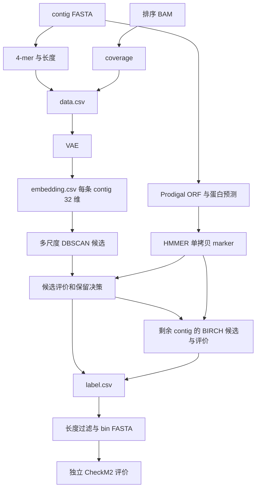

# LorBin 复现与源码阅读教程

本教程按执行顺序讲清每一步的**输入、命令、输出和源码**，最后说明应该做到什么程度才算完成复现。镜像构建见 [README](Readme.md)，Windows 命令行操作见 [WINDOWS_DOCKER.md](WINDOWS_DOCKER.md)，CheckM2 脚本环境与 TSV 查看见 [scripts/README.md](scripts/README.md)。

下文的 `LorBin`、`minimap2` 等命令是 **Linux 容器内命令**，不能直接作为 Windows 主机命令执行。想逐步调试，按 Windows 教程进入容器；想跑完整流程，使用 `LorBin bin`。

## 1. 先把流程理解成六部分

1. **输入数据**：FASTA 保存 contig 的 DNA 序列，排序 BAM 保存 reads 比对到这些 contig 的位置。
2. **特征和基因证据**：FASTA 算 4-mer，BAM 算 coverage，合并成特征表；同一份 FASTA 另做 ORF/蛋白预测和单拷贝 marker 检测。
3. **VAE 表示学习**：处理后的特征进入 VAE，每条 contig 得到一个 32 维向量。
4. **多尺度 DBSCAN**：用不同距离和尺度形成候选簇，结合 marker 和预训练模型评价、筛选。
5. **多阈值 BIRCH**：处理第一阶段未保留的 contig，再评价候选，合并标签。
6. **导出和独立评价**：按标签导出 bin FASTA，再交给 CheckM2 估计质量。

**BAM 是输入，最终结果是 FASTA 格式的 bin，不是 BAM。** 32 维表示不是 32 个 bin；DBSCAN 的“多尺度”也不是简单把向量的 32 个维度分别聚类。



marker 是一条辅助证据支路，没有作为额外 ORF 特征拼进本例 VAE 的原始输入。

## 2. 总入口与源码地图

### 完整流程命令

```bash
LorBin bin -fa /data/CRR451057.hifiasm.fna \
  -b /data/CRR451057.sorted.bam \
  -o /out/result --epoch 300
```

它会生成特征和 marker、训练 VAE、聚类并导出。`/out` 必须挂载到主机，否则容器删除后可能丢失结果。不要对正在运行或已经完成的实验重复使用同一输出目录。

入口是 [`lorbin.py`](LorBin/lorbin/lorbin.py) 的 `main()`：

```text
main()
  → generate_data()
  → generate_markers()
  → train_vae()
  → cluster()
      → bin_cluster()
      → write_bin()
```

| 顺序 | 核心源码 | 需要理解的事情 |
| --- | --- | --- |
| 0 输入 | [check_arg.py](LorBin/lorbin/check_arg.py) | 文件、路径和基本参数校验 |
| 1 数值特征 | [generate_kmer.py](LorBin/lorbin/generate_kmer.py)、[generate_coverage.py](LorBin/lorbin/generate_coverage.py) | 每条 contig 的 TNF、coverage 和长度 |
| 2 基因证据 | [orffinding.py](LorBin/lorbin/orffinding.py)、[utils.py](LorBin/lorbin/utils.py) | ORF、HMM 命中和 contig → marker 对应关系 |
| 3 VAE | [model/vae.py](LorBin/lorbin/model/vae.py) | 归一化、损失、训练和编码器输出 |
| 4–5 聚类 | [cluster.py](LorBin/lorbin/cluster.py) | 候选生成、评价、保留和再聚类 |
| 4–5 评价模型 | [EvaluationModel.py](LorBin/lorbin/model/EvaluationModel.py)、[KeepModel.py](LorBin/lorbin/model/KeepModel.py) | 候选得分与保留决策 |
| 6 导出 | [lorbin.py](LorBin/lorbin/lorbin.py) 的 `write_bin()` | 标签映射回序列、总长度过滤 |
| 7 外部评价 | [scripts/README.md](scripts/README.md) | CheckM2 与 HQ/MQ 汇总 |

两个 Dockerfile 安装的是 `LorBin/dist/lorbin-0.1.0.tar.gz`，不是自动安装旁边的松散源码。**只修改 `.py` 文件后重新构建镜像，不会自动把修改写入旧归档。** 改造时还需要重新打包并安装，或明确调整安装方式。

此前静态核对记录表明，正常 CLI 使用的模块对应官方提交 `ee10232282c2b71ed3ce2a34d5dbd78af3dd0b0a`；当时安装归档 SHA256 为 `edb2e20b2042c2ab89c8663028352f5c9c5b5a392685b1bee3b8c85c8c89ecea`。归档还包含 CLI 不使用的旧备份文件，因此不能把整个归档称为官方逐字节原件。本次只更新文档，没有重新进行归档比对。

## 3. 第 0 步：FASTA 与 BAM 输入

**输入**：组装后的 contig FASTA，以及 reads 比对到同一份组装的排序 BAM。本例已有这两份文件，放在主机 `data/`，挂载到容器 `/data/`。

FASTA 的序列 ID 应与 BAM 的参考序列名一致。BAM 不是基因组序列文件，而是比对记录。coverage 计算要求排序 BAM；不能拿其他组装的 BAM 与当前 FASTA 混用。

**对应命令**：完整流程的 `-fa`、`-b` 参数指定两份输入。已有 BAM 时不用重新比对。

只有原始 reads 时，可先制作 BAM。下面仅适用于 HiFi reads，其他测序类型需要相应的 minimap2 preset：

```bash
minimap2 -ax map-hifi /data/contigs.fna /data/reads.fastq \
  | samtools view -b -F 4 - \
  | samtools sort -@ 8 -o /out/reads.sorted.bam -
samtools index /out/reads.sorted.bam
```

**输出**：排序 BAM 和索引。它们仍然是 LorBin 的输入材料，不是最终 bins。

**阅读源码**：`check_arg.py:check_generate_data()` 和 `lorbin.py:main()`。检查参数的函数不会证明 FASTA/BAM 在生物学上完全匹配，输入来源还需要自己记录。

## 4. 第 1 步：4-mer、coverage 和特征表

**输入**：FASTA 和 BAM。

**对应命令**：

```bash
LorBin generate_data -fa /data/CRR451057.hifiasm.fna \
  -b /data/CRR451057.sorted.bam -o /out/features
```

这条子命令还会做下一步的 marker 检测。下面按逻辑拆开说明，不代表需要再运行一次同样的命令。

### 4-mer 从哪里来

`generate_kmer_features_from_fasta()` 对至少 1,500 bp 的 contig 统计连续四个碱基的组合频率。反向互补组合合并后为 **136 维 TNF**。含非 A/T/G/C 字符的窗口不参与计数，并记录 contig 长度。

### coverage 从哪里来

`generate_cov()` 调用 `bedtools genomecov -bga -ibam`，计算至少 1,000 bp 的 contig 的平均深度，去掉首尾各 75 bp，再加一个很小的数避免后续数值问题。

源码中的数组名 `rpkm` 容易造成误解：当前这里算的是平均覆盖深度，不是按标准 RPKM 公式计算。coverage 提供丰度的代理信息，但不同样本的测序深度也会影响它。

**输出**：

| 文件 | 内容 |
| --- | --- |
| `length.csv` | contig ID 和长度 |
| `<BAM文件名>_0_data_cov.csv` | 一个 BAM 对应的 contig 平均 coverage；多个 BAM 各有一份 |
| `data.csv` | 按 contig ID 内连接后的 TNF、各 BAM coverage 和长度 |

单 BAM 时，`data.csv` 有 **136 + 1 + 1 = 138 个数值列**，另有 contig ID 索引列。因此普通 CSV 查看器可能显示 139 列，两种说法不是同一计数口径。

**检查重点**：ID 唯一、数值非空、两种特征按同一 contig 对齐。覆盖度表与最终特征表行数可以不同，因为长度过滤门槛不同，最后又做 inner join。

**阅读源码**：`generate_kmer.py`、`generate_coverage.py:calculate_coverage()/generate_cov()/combine_cov()`、`lorbin.py:generate_data()`。

## 5. 第 2 步：为什么还有 ORF 和 marker

**输入**：同一份 FASTA。**对应命令**：包含在 `bin` 和 `generate_data` 中，没有独立的 `LorBin marker` 子命令。

ORF 是开放阅读框，可理解为可能编码蛋白质的 DNA 区段。Prodigal 预测 ORF 并翻译成蛋白；HMMER 的 `hmmsearch` 用包内 `marker.hmm` 搜索保守单拷贝 marker。

**输出**：`markers.hmmout`，是 HMMER 的 domain 命中表。ORF/蛋白的中间文件默认放在临时目录，不会全部保留到最终结果目录。

`get_marker()` 把命中解析成“contig → marker 列表”。候选 bin 找到多少不同 marker、重复多少，能为完整度和混入程度提供代理证据。它们不等于真实质量，也不等于 CheckM2 的评分。

**检查重点**：marker 命中对应当前 FASTA。`utils.py` 会复用已有 `markers.hmmout`；换输入时使用新目录，避免复用旧 marker。

**阅读源码**：`lorbin.py:generate_markers()` → `utils.py:generate_markers()` → `orffinding.py:run_prodigal()`；再读 `utils.py:get_marker()`。

## 6. 第 3 步：VAE 得到 32 维 embedding

**输入**：`data.csv`。`train_vae()` 按列取出 TNF、coverage 和长度，再调用 `normalize()`。

VAE 使用处理后的 TNF、相对丰度和总丰度变换值。长度主要用于训练损失权重，不是直接作为普通的一维特征塞进编码器。单 BAM 的相对丰度与总丰度处理也要结合 `normalize()` 阅读，不能只按原始表格拼接理解。

**对应命令**：完整 `bin` 中自动训练；想单独了解训练入口，可使用：

```bash
LorBin train --data /out/features/data.csv -o /out/vae_only
```

这个子命令的默认参数与 `bin` 不完全相同。当前 `bin` 内部初始 batch size 为 64、batchsteps 为 `[25]`；`train` 默认是 128 和 `[30,100]`。`train` 的显式数字参数还存在缺少 argparse 类型声明的问题，不要假设改一个参数就能等价复现一键流程。

**输出**：`model.pt` 保存本轮 VAE 权重；`embedding.csv` 保存编码器均值向量 μ，每条 contig **32 维**。

**检查重点**：embedding 的 ID 与特征表一致、行数一致；日志到达预期 Epoch，损失没有异常非有限值。Loss/AB/SSE/KLD 是训练信息，不能直接当作分箱精度。

**阅读源码**：`lorbin.py:train_vae()` 和 `vae.py:normalize()/make_dataloader()/VAE.trainmodel()/get_latent()`。

## 7. 第 4 步：多尺度 DBSCAN 与候选评价

**输入**：embedding、contig 原序列与长度、marker 对应关系，以及包内预训练评价模型。

**对应命令**：完整 `bin` 中自动执行；已有 embedding 时可单独运行两阶段聚类：

```bash
LorBin cluster -fa /data/CRR451057.hifiasm.fna \
  --embeddingdir /out/vae_only/embedding.csv -o /out/cluster_only
```

这条命令包含 DBSCAN、BIRCH 和导出，也会生成 marker；不是只运行 DBSCAN。

代码计算欧氏与余弦近邻距离图，选择多个 `eps` 形成候选簇。不同尺度的候选可能重叠，不能直接把每个候选当成一个最终 bin。

`get_bin_best()` 用 marker 种数和重复比例构造代理特征，`EvaluationModel` 为候选打分，`KeepModel` 为第一阶段给出保留决策。默认 `no_markers` 不使用详细 marker 身份向量，但仍使用 marker 的汇总信息，名字不表示完全不用 marker。

**输出**：候选、得分和保留列表主要在内存中；日志记录聚类阶段，没有自动为每个 eps 导出一套候选文件。

**源码注意**：当前代码把 contig 的 bp 长度作为 DBSCAN `sample_weight`，而 `min_samples=5`。根据该库定义，达到此权重的单个样本就可以是核心样本；这些 contig 均长于此阈值。因此不能直接按通常“邻居至少几个”的方式解释这里的密度筛噪声。这是根据源码和库定义的推断，改造密度反馈前应单独核验。[DBSCAN 1.1 参数定义](https://scikit-learn.org/1.1/modules/generated/sklearn.cluster.DBSCAN.html)

**阅读源码**：`cluster.py:bin_cluster()/get_bin_best()`、`model/EvaluationModel.py`、`model/KeepModel.py`。本次主流程训练的是 VAE，没有重新训练这两个预训练评价模型。

## 8. 第 5 步：BIRCH 对剩余 contig 再聚类

**输入**：第一阶段未进入保留 bin 的 contig 及其 embedding、marker。

**对应命令**：仍属于上一节的 `LorBin cluster` 或完整 `bin`，没有独立 BIRCH 子命令。

日志出现 `start recluster` 后，程序用多个 BIRCH threshold 形成候选，继续评价，再与第一阶段保留结果合并。

**输出**：合并标签的内存结果，随后在第 6 步写文件。

**源码注意**：BIRCH 阶段虽然得到 `max_bin, keep`，却仍无条件执行 `extracted.append(max_bin.copy())`，没有像第一阶段那样用 `keep` 控制保留。候选阶段最小长度与最终导出门槛也不同。改造时需要区分当前实现的实际行为与论文示意流程。

**阅读源码**：`cluster.py:bin_cluster()` 中 `start recluster` 后的代码。

## 9. 第 6 步：标签与 bin FASTA 导出

**输入**：合并后的 contig 标签和原始 FASTA 序列。**对应命令**：由 `bin/cluster` 自动执行，没有独立导出子命令。

`cluster()` 写 `label.csv`，`write_bin()` 把同标签序列合并到一个 FASTA。`-1` 表示未分配；达到默认总长度 **80,000 bp** 的标签组才导出。

**输出**：`label.csv` 和 `output_bins/bin.<标签>.fa`。

标签个数、FASTA 文件数、HQ 数量是三个不同数字。某条 contig 即使有非负标签，也可能因所属 bin 未达到长度门槛而没有导出。

**阅读源码**：`lorbin.py:cluster()/write_bin()`。当前默认值能用于已有基线；显式传 `--bin_length` 存在类型声明缺失的问题，修改前需要检查代码。

## 10. 第 7 步：独立 CheckM2 评价

**输入**：最终 `output_bins/*.fa`。CheckM2 不读 LorBin 的 BAM、embedding 或模型，也不修改 bins。

**对应入口**：`scripts/run_checkm2.bat`。它在独立 Docker 镜像中执行 CheckM2 1.0.2，使用数据库 v2，再自动汇总。只统计已有报告使用 `scripts/summarize_checkm2.bat`，不运行预测。

**输出**：`checkm2/origin/quality_report.tsv` 保存原始质量估计，`checkm2/summary/` 保存统计与来源记录。运行条件、参数、最新轮次规则、HQ/MQ 阈值和 Excel 查看方法集中在 [脚本教程](scripts/README.md)。[CheckM2 1.0.2 版本与数据库说明](https://github.com/chklovski/CheckM2/releases/tag/1.0.2)

## 所有文件分别用于什么

以下以一轮的 `result/` 为根。不同运行产生多套文件是正常的，每套文件要与本轮输入和参数配套。

| 文件 | 作用 | 谁使用 |
| --- | --- | --- |
| `LorBin.log` | 阶段、训练和异常记录 | 人查看进度和问题 |
| `length.csv` | contig 长度 | 特征合并与训练权重 |
| `*_data_cov.csv` | BAM coverage | 特征合并 |
| `data.csv` | 数值特征表 | VAE |
| `markers.hmmout` | marker 命中 | 聚类候选评价 |
| `model.pt` | 本轮 VAE 权重 | 模型留档和后续实验 |
| `embedding.csv` | 每条 contig 的 32 维表示 | DBSCAN 和 BIRCH |
| `label.csv` | contig 的聚类标签 | 导出与成员比较 |
| `output_bins/*.fa` | 最终导出的候选基因组 bins | CheckM2 和后续生物分析 |

轮次外层的 `run-info.json/status.txt` 由后台脚本生成；手动 Docker 方式的记录不同，见 Windows 教程。CheckM2 的原始产物、统计和溯源文件说明放在脚本教程中，避免在这里重复字段表。

`output/` 是基于官方版本在本机生成的历史输出，可能混有多次运行。新实验使用 `runs/<轮次>/result/`，不能把旧目录里的中间文件拼成一轮新的实验。

## 怎样和官方结果比较

**官方 demo 没有公开“本样本必须得到 N 个 HQ 才通过”的统一门槛。** 复现应按下面四层核对，而不是仅过一次 CheckM2 或只数文件。

| 层次 | 应保存的证据 |
| --- | --- |
| 环境和输入 | 源码提交、实际安装包、镜像 ID、工具版本、FASTA/BAM 哈希、完整命令 |
| 流程完整 | 容器结束且退出码 0、预期轮数完成、特征/embedding/标签 ID 对齐、bins 非空且序列来源正确 |
| 本机重复与质量 | 相同设置另跑一轮，比较 contig 分组和质量报告；记录完整度、污染度及统一口径的 HQ/MQ 数量 |
| 论文级对照 | 相同评测样本集、预处理、参数、软件和数据库版本，对照官方指标与其他方法 |

重新编号不改变分箱成员，所以不能只用标签编号或文件名判断是否相同。覆盖度列名还包含传入的 BAM 路径，表格哈希不同时先区分路径文字与实际数值差异。

当前本机记录的轮次 `CRR451057_20260930_104313_903_26756` 状态为 `SUCCEEDED`、退出码 0、完成 300 轮，导出 95 个候选 bin。磁盘中现有 CheckM2 汇总为 **HQ 5、互斥 MQ 4、Other 86，HQ+MQ 为 9**，位置是：

```text
runs/CRR451057_20260930_104313_903_26756/checkm2/origin/quality_report.tsv
runs/CRR451057_20260930_104313_903_26756/checkm2/summary/quality_summary.txt
```

这是本次阅读已有文件得到的记录，没有重新训练或预测。它可作为改进实验的单样本基线，不能当作 Light 镜像的验证结果，也不能与论文跨样本总数量直接比较。

如果要证明“与官方在此输入上的结果一致”，需要作者给出的同输入参考结果，或独立运行固定官方版本进行对照。基于官方版本在本机跑出结果，支持完成流程复现，不自动等于论文全部结论复现。[官方 LorBin](https://github.com/LorMeBioAI/LorBin)

